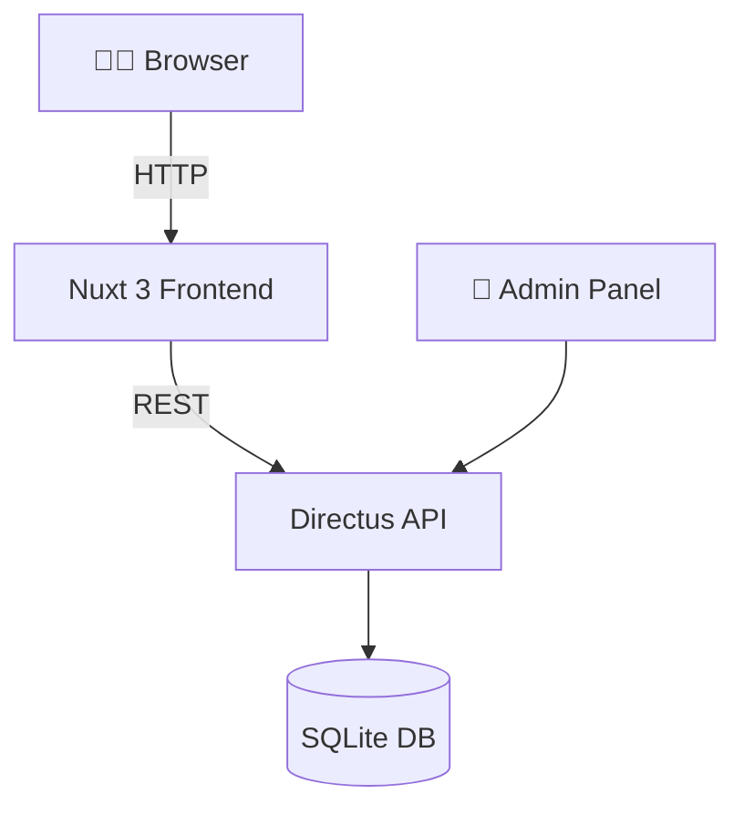

# 🌐 Girls in IT – Event Platform

Et moderne fullstack-projekt, der forbinder teknologi med empowerment. Denne platform er skabt til at vise og administrere events, hosts og deres indhold – med fokus på design, skalerbarhed og datasikkerhed.

---

## 🔧 Teknologistack

| Lag | Teknologi | Beskrivelse |
|-----|-----------|-------------|
| Frontend | Nuxt 3 (Vue.js) + Tailwind CSS | SEO-venlig, komponentbaseret og mobiloptimeret UI |
| Backend | Directus (Docker container) | Headless CMS med REST/GraphQL, roles & permissions |
| Database | SQLite | Simpel og embedded til udviklingsbrug |
| Deployment | Docker | Containerized setup for lokal eller cloud drift |
| Auth | Supabase Auth | Brugergodkendelse til frontend med sessionhåndtering |

---

## 📁 Projektstruktur

```
giit-web/          # Fullstack-eventplatform med Nuxt 3 og Directus
├── frontend/          # Nuxt 3 + Tailwind frontend
│   ├── components/
│   ├── pages/
│   └── assets/
├── backend/           # Directus backend med docker-compose
│   ├── docker-compose.yml
│   └── data/          # SQLite-database bind mount
└── README.md
```

---

## 🧠 Arkitekturdiagram (tekstversion)



---

## 🚀 Kom i gang

1. **Clone projektet**
```bash
git clone https://github.com/din-bruger/giit-platform.git
cd giit-platform
```

2. **Start Directus backend**
```bash
cd backend
cp .env.example .env
docker compose up -d
```

3. **Start frontend**
```bash
cd frontend
npm install
npm run dev
```

4. Gå til `http://localhost:3000` og se din platform i aktion!

---

## 🔑 Brugergodkendelse (Auth)

Platformen anvender **Supabase Auth** til brugergodkendelse og sessioner på frontend.

- Login og session-håndtering sker via `@supabase/auth-helpers-nuxt`
- Tokens gemmes sikkert i cookies via SSR-friendly strategi
- Mulighed for at oprette konto, logge ind, samt beskytte admin-ruter

Eksempel på integration:
```ts
const client = useSupabaseClient()
const user = useSupabaseUser()
await client.auth.signInWithPassword({ email, password })
```

---

## 🔐 Sikkerhed

- `.env`-filer er udelukket med `.gitignore`
- Følsomme oplysninger (admin-passwords, API-nøgler) er environment-specifikke
- Offentlig repo-friendly (ingen credentials eksponeret)
- CORS er kun åbnet til `localhost:3000` under udvikling
- Supabase sessioner håndteres via `auth-helpers` og er beskyttet mod XSS og CSRF

---

## 📸 Billeder & Ressourcer

| Element        | Beskrivelse                             |
|----------------|-----------------------------------------|
| 🎨 Logo        | Specialdesignet SVG logo                |
| 📷 Host-billeder | Gemmes som Directus asset (PNG)       |
| 🖼️ Event-billeder | Understøtter full-width + gradient overlay |
| 🎚️ UI Design   | Tailwind utility-classes + dark mode support |

---

## 💡 Formål

At skabe en platform der:

- 💻 Lærer moderne webteknologi via praksis
- 🎤 Fremhæver kvindelige værter i tech
- 📅 Promoverer events med god brugeroplevelse
- 📦 Er nem at vedligeholde og videreudvikle

---

> Skabt med af Hidesh Kumar!