# 🌐 Girls in IT – Event Platform

A modern fullstack project that connects technology with empowerment. This platform is created to showcase and manage events, hosts, and their content – with a focus on design, scalability, and data security.

---

## 🔧 Technology Stack

| Layer | Technology | Description |
|-------|------------|-------------|
| Frontend | Nuxt 3 (Vue.js) + Tailwind CSS | SEO-friendly, component-based, and mobile-optimized UI |
| Backend | Directus (Docker container) | Headless CMS with REST/GraphQL, roles & permissions |
| Database | SQLite | Simple and embedded for development use |
| Deployment | Docker | Containerized setup for local or cloud operation |
| Auth | Supabase Auth | User authentication for frontend with session management |

---

## 📁 Project Structure

```
giit-web/          # Fullstack event platform with Nuxt 3 and Directus
├── frontend/          # Nuxt 3 + Tailwind frontend
│   ├── components/
│   ├── pages/
│   └── assets/
├── backend/           # Directus backend with docker-compose
│   ├── docker-compose.yml
│   └── data/          # SQLite database bind mount
└── README.md
```

---

## 🧠 Architecture Diagram (text version)

```mermaid
graph TD
  User[🧑‍💻 Browser] -->|HTTP| NuxtFrontend[Nuxt 3 Frontend]
  NuxtFrontend -->|REST| DirectusAPI[Directus API]
  DirectusAPI --> SQLiteDB[(SQLite DB)]
  Admin[🔐 Admin Panel] --> DirectusAPI
```



---

## 🚀 Getting Started

1. **Clone the project**
```bash
git clone https://github.com/your-user/giit-platform.git
cd giit-platform
```

2. **Start Directus backend**
```bash
cd backend
cp .env.example .env
docker compose up -d
```

3. **Start frontend**
```bash
cd frontend
npm install
npm run dev
```

4. Go to `http://localhost:3000` and see your platform in action!

---

## 🔑 User Authentication (Auth)

The platform uses **Supabase Auth** for user authentication and sessions on the frontend.

- Login and session management happen via `@supabase/auth-helpers-nuxt`
- Tokens are securely stored in cookies using an SSR-friendly strategy
- Ability to create accounts, log in, and protect admin routes

Example integration:
```ts
const client = useSupabaseClient()
const user = useSupabaseUser()
await client.auth.signInWithPassword({ email, password })
```

---

## 🔐 Security

- `.env` files are excluded with `.gitignore`
- Sensitive information (admin passwords, API keys) are environment-specific
- Public repo-friendly (no credentials exposed)
- CORS is only opened to `localhost:3000` during development
- Supabase sessions are handled via `auth-helpers` and protected against XSS and CSRF

---

## 📸 Images & Resources

| Element        | Description                             |
|----------------|-----------------------------------------|
| 🎨 Logo        | Custom-designed SVG logo                |
| 📷 Host images | Stored as Directus assets (PNG)         |
| 🖼️ Event images | Supports full-width + gradient overlay |
| 🎚️ UI Design   | Tailwind utility classes + dark mode support |

---

## 💡 Purpose

To create a platform that:

- 💻 Teaches modern web technology through practice
- 🎤 Highlights female hosts in tech
- 📅 Promotes events with great user experience
- 📦 Is easy to maintain and further develop

---

> Created by me - Hidesh Kumar!